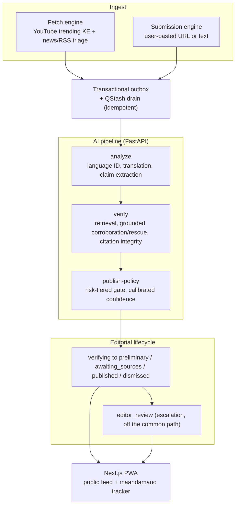

# fact_checker_ke

**An autonomous AI fact-checker and maandamano (protest) advisory tracker for Kenya.** It surfaces viral Kenyan claims on its own, assesses them with grounded AI, and publishes confidence-weighted, cited assessments — never a bare verdict.

[](LICENSE)
[](https://github.com/ericgitangu/fact_checker_ke/pulls)
[](https://www.typescriptlang.org)
[](https://www.python.org)
[](https://nextjs.org)
[](https://fastify.dev)
[](https://fastapi.tiangolo.com)
[](https://orm.drizzle.team)
[](https://neon.tech)
[](https://cloud.google.com/run)
[](https://vercel.com)
[](https://upstash.com)
[](https://pnpm.io)
[](https://moonrepo.dev)
[](https://www.anthropic.com)
[](https://ai.google.dev)
[](https://zod.dev)
[](https://vitest.dev)
[](https://docs.pytest.org)

## What it is

Kenyan social and news feeds move faster than any human fact-checking desk can. fact_checker_ke closes that gap autonomously: it ingests claims from two sources, runs them through a grounded AI pipeline, and drives each one to a terminal state — published, dismissed, or waiting on sources — without a human editor in the common path. A separate maandamano page tracks protest advisories (area, status, sources).

Two things it refuses to do:

- **No bare verdicts.** Every published assessment carries a calibrated confidence score and its supporting citations. A claim the pipeline cannot corroborate is marked *awaiting sources* or *unproven*, not forced to true/false.
- **It rates claims, not people.** The output is an assessment of a statement, with a right of reply for the subject of any named-person claim. It is not a judgment on anyone's character, and the project makes no IFCN-signatory representation.

Autonomy-first does not mean human-free: a claim can be escalated to `editor_review` when the policy gate flags it (legal risk, low confidence on a named person, contested sources). That path exists; it is off the common path by design.

## Architecture

Two ingest engines feed one event-driven pipeline. The **fetch engine** pulls candidate claims autonomously (YouTube trending `mostPopular` for Kenya, plus a fact-check news RSS triage served via Google News, which surfaces PesaCheck / Africa Check / AFP items); the **submission engine** takes a URL or raw text from a user. Both land on the same path: `submission.received` → **analyze** → **verify** → **publish-policy** → an editorial **lifecycle** that ends in a terminal state. State changes and the events announcing them commit together through a transactional outbox, drained by QStash with idempotency so at-least-once delivery is safe to retry. Status streams to the client over SSE in near-real-time.



Stage detail:

- **analyze** — language identification (English / Swahili / Sheng), translation to a working language, and extraction of checkable claims (as opposed to opinion, prediction, or rhetoric). Model: Claude Haiku. A bare video URL with no quote is made checkable from the publisher's *lawful* metadata (title + description — never a scraped transcript); a submission with nothing checkable returns an honest `needs_quote` / `no_checkable_claims` rather than a fabricated analysis. Audio is transcribed (Google Chirp_2) only for the compliant subset — owner/partner/open-licensed — never third-party media.
- **verify** — evidence retrieval (Google Fact Check Tools API), independent corroboration and grounded rescue via Google Vertex AI Gemini grounding, and a citation-integrity check that every cited source actually supports the drafted assessment. A relevance-and-recency guard weighs each source by registry tier and date, so an off-topic or stale article can't be borrowed to manufacture a verdict. Draft model: Claude Sonnet. Readers can strengthen a verdict by submitting a source: it *re-grounds* the claim and can only move the assessment forward, never silently downgrade it (the crowdsource flywheel).
- **publish-policy** — a risk-tiered gate. Higher-risk claims (named person, legal exposure) demand higher confidence and more corroboration before auto-publish; below threshold they route to `awaiting_sources` or `editor_review`.
- **lifecycle** — `verifying` → one of `preliminary`, `awaiting_sources`, `published`, `dismissed`; escalation to `editor_review` and back; `archived_expired` for stale items. A rescue can re-enter a dismissed claim as a thread starter rather than dead-ending it.

Deeper diagrams (sequence flows, data model, infra topology) live in [docs/architecture.md](docs/architecture.md) and [docs/architecture/](docs/architecture/).

## Monorepo layout

pnpm workspaces (`apps/*`, `packages/*`, `services/api`) with [moonrepo](https://moonrepo.dev) as the task runner. The Python pipeline is managed separately by `uv` and is not a pnpm workspace.

```
fact_checker_ke/
├── apps/
│   ├── web/            Next.js PWA — public feed, submit flow, maandamano tracker, BFF route handlers (Vercel)
│   └── site/           Retired marketing SPA, now a redirect-only stub to apps/web
├── packages/
│   ├── core/           Shared zod schemas and inferred TypeScript types — the single source of request/response shapes
│   ├── db/             Drizzle ORM schema + SQL migrations against Neon Postgres
│   ├── i18n/           en / sw copy
│   └── brand/          Shared brand tokens (color, type) consumed by the web app
├── services/
│   ├── api/            Fastify + TypeScript BFF/API — submissions, checks, health, SSE (Cloud Run)
│   └── pipeline/       FastAPI + Python (uv) — the analyze/verify/publish-policy AI pipeline (Cloud Run)
├── infra/              Terraform IaC — Cloud Run, Neon, Upstash, Workload Identity Federation, scale-to-zero plan-guard
└── docs/               Architecture notes, decision records, legal, research, runbooks
```

An Expo mobile client (native share-sheet intake, talking to the API directly without the BFF) is planned and not yet in the tree.

## Quickstart

### Prerequisites

| Tool | Version | Notes |
|---|---|---|
| Node.js | 24.x | enforced via `engines` |
| pnpm | 9.15.0 | pinned via `packageManager`; provisions moon and the Node toolchain |
| Python | 3.12 | pipeline only, via `uv` |
| uv | latest | Python dependency and venv manager |
| Docker | any recent | optional — local Postgres (pgvector) + Redis for API persistence work |

### Install and run

```bash
pnpm install                          # installs JS deps, provisions moon + the Node toolchain

# Full local gate: affected-only lint, typecheck, test, build
pnpm exec moon ci

# Run one project task
moon run api:dev                      # Fastify API
moon run web:dev                      # Next.js PWA
moon run core:gen-contracts           # regenerate contracts (zod -> JSON Schema -> Pydantic)

# Python pipeline
cd services/pipeline && uv sync && uv run uvicorn app.main:app --reload

# Local Postgres (pgvector) + Redis
docker compose up -d postgres redis
```

Copy each service's `.env.example` to `.env` and fill in local values before running anything that needs secrets. No secrets belong in the repo.

### Tests

```bash
pnpm exec moon ci                     # TS: vitest across affected projects
moon run api:test                     # a single project's vitest suite
cd services/pipeline && uv run pytest  # Python pipeline tests
```

There is no GitHub Actions CI badge: Actions billing is currently locked on this account, so `moon ci` and the local suites are the real gate until it is restored.

## Tech stack

| Layer | Technology |
|---|---|
| Web / PWA | Next.js (App Router), React, deployed on Vercel |
| API / BFF | Fastify, TypeScript — on GCP Cloud Run |
| AI pipeline | FastAPI, Python 3.12 (uv) — on GCP Cloud Run |
| Shared contracts | zod schemas + inferred TypeScript types (`packages/core`) |
| Database | Neon serverless Postgres with pgvector, Drizzle ORM |
| Queue / cache / cron | Upstash Redis + QStash |
| AI models | Anthropic Claude (Haiku for analyze, Sonnet for verify draft); Google Vertex AI Gemini grounding (corroboration + rescue); Google Fact Check Tools API (retrieval); Google Chirp_2 speech-to-text (compliant-subset audio only) |
| Discovery | YouTube Data API (trending KE) + Google News fact-check RSS triage |
| Infrastructure | Terraform IaC; GCP Cloud Run in `africa-south1`, scale-to-zero |
| Monorepo / build | pnpm workspaces + moonrepo |
| Testing | Vitest (TypeScript), Pytest (Python) |
| Quality gates | Conventional Commits (commitlint), gitleaks pre-commit, lefthook hooks |

## Engineering practices

- **Test-driven.** Features land with their tests — vitest for TypeScript, pytest for Python. The contract (inputs → outputs) is what gets tested, not internals.
- **One contract source.** Request/response shapes are defined once as zod schemas in `packages/core` and generated into Pydantic for the Python side; a drift check fails the build if the two diverge.
- **Transactional outbox + idempotency.** A state change and the event announcing it commit in one transaction; client idempotency keys, a QStash inbox, and a content-hash result cache make at-least-once delivery safe to retry.
- **Scale-to-zero cost discipline.** A Terraform plan-guard fails any plan that provisions an always-on resource — no NAT gateway, no `min_instance_count > 0`, no unattached static IP. (The Compute Engine, Cloud SQL and Memorystore APIs are left disabled entirely, so those cost traps can't be created at all.)
- **Metered abuse guardrails.** Every AI engine spends against a per-lane daily USD breaker (analyze/verify, grounding, speech, fetch) that hard-stops at budget; intake is gated by a required device token, a per-device daily quota, and IP rate limits on token minting and the waitlist. An abuse spike or viral day is bounded to a known dollar figure, not a surprise bill.
- **Decision records.** Material architecture decisions are written up under [docs/](docs/) before they are trusted, each with the options considered, the trade-off accepted, and a review trigger.

## Documentation

- [docs/architecture.md](docs/architecture.md) and [docs/architecture/](docs/architecture/) — system diagrams and component notes
- [docs/](docs/) — decision records, legal/compliance notes, research, and operational runbooks

Built for Kenya's Data Protection Act 2019: every published assessment carries an evidence file (cited sources, retrieved document IDs, archived snapshots) and a right of reply for the subject of a named-person claim.

## Contributing

Issues and PRs are welcome. Start with [CONTRIBUTING.md](CONTRIBUTING.md) for the workflow (Conventional Commits, the RED→GREEN test expectation, and the gitleaks pre-commit hook). By participating you agree to the [Code of Conduct](CODE_OF_CONDUCT.md).

## Security

Found a vulnerability? Please follow the disclosure process in [SECURITY.md](SECURITY.md) — do not open a public issue for security reports. This is a defamation and abuse target by design, so the policy covers both software vulnerabilities and content-integrity concerns.

## License

[Apache-2.0](LICENSE). The credibility-registry weights, abuse thresholds, and production system prompts are kept private; only their public type interfaces ship in this repo.

## Author

Eric Gitangu — [@ericgitangu](https://github.com/ericgitangu)
