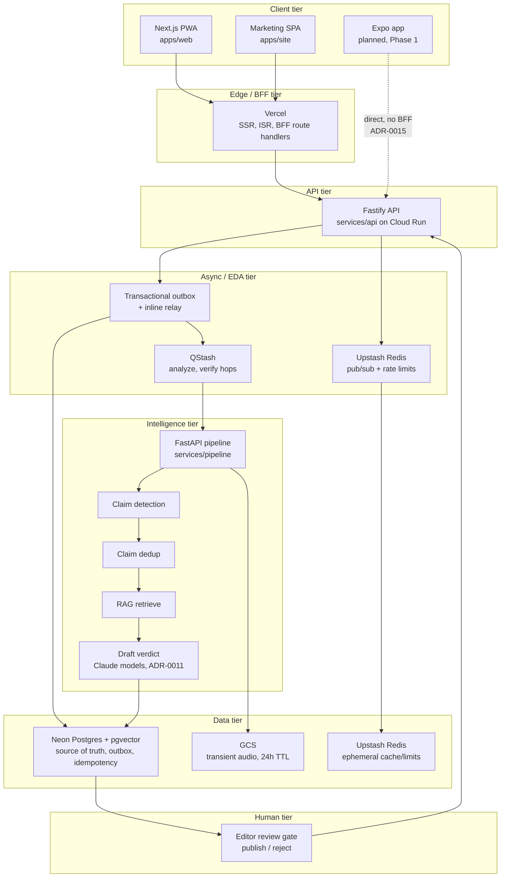
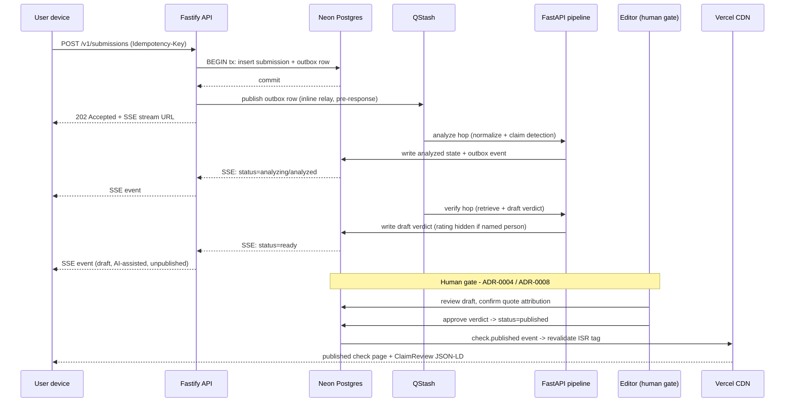

# fact_checker_ke

**Multilingual (EN / Swahili / Sheng) fact-checking for Kenya's creator boom — and a maandamano (protest) advisory tracker — built human-review-first.**

[](docs/adr/0026-open-source-boundary-licence.md)
[](https://github.com/ericgitangu/fact_checker_ke/pulls)
[](https://nodejs.org)
[](https://www.python.org)
[](https://pnpm.io)
[](https://moonrepo.dev)
[](https://nextjs.org)
[](https://fastapi.tiangolo.com)
[](https://www.terraform.io)
[](https://cloud.google.com/run)
[](https://neon.tech)
[](https://upstash.com)

> No GitHub Actions CI badge — Actions billing is currently locked on this account (see [ADR-0013](docs/adr/0013-git-workflow.md)). `moon ci` and the acceptance-test suites run locally and are the real gate until that's restored.

## What this is

A user pastes a URL (news article, X/Threads post, a YouTube/TikTok video) or raw text. The pipeline normalizes it, detects checkable claims (as opposed to opinion, prediction or rhetoric), deduplicates against existing checks, retrieves evidence through credibility-aware RAG, and drafts a verdict with Claude models. **Every verdict is reviewed and approved by a human editor before it is published.** A separate, editor-curated maandamano page shows protest advisories (area, status, sources) at ward-level granularity, with no live crowd-sourced pins.

**What it explicitly does not do:**
- **No audio download from third-party platforms.** YouTube and TikTok's developer terms don't permit it (see [ADR-0002](docs/adr/0002-content-ingestion.md)). For third-party video, the *user* supplies the quoted text and timestamp; the UI says plainly *"We checked the quote you provided, not the video audio."*
- **No unreviewed verdicts.** A draft shown to the submitter carries `rating: null` for any named-person claim until an editor confirms quote attribution against the source ([ADR-0004](docs/adr/0004-verification-pipeline.md)).
- **No IFCN claims.** This project is not an IFCN signatory and makes no such representation.
- **It rates claims, never people.** The product's output is "this statement is True / Misleading / False / Unproven" — never a verdict on a person's character.

## N-tier architecture



Terraform (`infra/`, see [ADR-0016](docs/adr/0016-deploy-rail-iac.md)) is the IaC home for every tier above — Cloud Run services/jobs, Neon and Upstash resources, Workload Identity Federation — gated by a scale-to-zero plan-guard. More on each tier: [docs/architecture/overview.md](docs/architecture/overview.md).

## A submission's life



The transactional outbox, idempotency keys and the two QStash hops are specified in [ADR-0017](docs/adr/0017-event-driven-core.md); SSE and caching in [ADR-0018](docs/adr/0018-realtime-and-caching.md).

## Monorepo map

| Project | Tech | Purpose |
|---|---|---|
| `apps/web` | Next.js (App Router) | PWA — submit form, `/checks/[id]`, `/maandamano`, BFF route handlers |
| `apps/site` | Vite + React | Marketing SPA — hero, methodology, waitlist |
| `apps/mobile` | Expo (planned, Phase 1) | Native share-sheet intake; talks to the API directly, no BFF ([ADR-0010](docs/adr/0010-client-strategy.md), [ADR-0015](docs/adr/0015-deployment-topology.md)) |
| `packages/core` | TypeScript, zod | Schemas, inferred types, ClaimReview builder, typed API client — the one source of request/response shapes for web and mobile |
| `packages/db` | Drizzle ORM | Typed Postgres schema and query layer |
| `db/migrations` | Plain SQL | Neon Postgres + pgvector migrations (expand-only, [ADR-0016](docs/adr/0016-deploy-rail-iac.md)) |
| `services/api` | Fastify | Submissions, checks, health, SSE — Cloud Run |
| `services/pipeline` | FastAPI (Python/uv) | normalize → claim detection → dedup → RAG retrieve → draft verdict — Cloud Run |
| `infra/` | Terraform | IaC rail: Cloud Run, Neon, Upstash, WIF, plan-guard — see [ADR-0016](docs/adr/0016-deploy-rail-iac.md) |
| `docs/adr` | Markdown | 30 architecture decision records — see [docs/adr/README.md](docs/adr/README.md) |

### moon task cheatsheet

```bash
pnpm install                       # provisions moon + the Node toolchain
pnpm exec moon ci                  # affected-only: lint, typecheck, test, build (the real local CI gate)
moon run <project>:<task>          # e.g. moon run api:test, moon run pipeline:typecheck
moon run core:gen-contracts && git diff --exit-code   # contracts drift gate (zod -> JSON Schema -> Pydantic)
docker compose up -d postgres redis   # local Neon-equivalent Postgres (pgvector) + Redis
cd services/pipeline && uv sync && uv run pytest      # Python pipeline tests

# Acceptance-test suites (RED->GREEN per ADR, see docs/adr/0019-test-strategy-redteam.md)
scripts/at/at-0013.sh
scripts/at/at-0014.sh
```

## Engineering practices

- **ADR-driven.** Every material decision is recorded as an ADR with options, trade-offs and a review trigger — [docs/adr/README.md](docs/adr/README.md) indexes all 30, plus the red-team process that re-attacks each one with edge cases before it's trusted.
- **RED → GREEN acceptance tests.** Every ADR ends with an `AT-<n>` table. A PR implementing an ADR must show the test failing first, then passing — no "trust me, it works" ([ADR-0019](docs/adr/0019-test-strategy-redteam.md)).
- **Transactional outbox + idempotency.** State changes and the event announcing them commit atomically; three idempotency layers (client key, QStash inbox, content-hash result cache) make at-least-once delivery safe to retry ([ADR-0017](docs/adr/0017-event-driven-core.md)).
- **Scale-to-zero cost discipline.** A Terraform plan-guard mechanically fails any plan that provisions an always-on resource — no NAT gateway, no `min_instance_count > 0`, no unattached static IP ([ADR-0016](docs/adr/0016-deploy-rail-iac.md), [ADR-0029](docs/adr/0029-cost-model-runway.md)).
- **Evidence-tagged research.** Every factual claim across the ADR set carries a tag: **[V]** verified against a primary/secondary source by adversarial vote, **[U]** unverified (re-check before depending on it), **[I]** inference with no direct source, **[GAP]** not researched — treat as unknown, not cleared. See the legend in [docs/adr/README.md](docs/adr/README.md).

## Status

**Pre-launch.** Nothing is deployed to production yet. Honest phase breakdown ([ADR-0001](docs/adr/0001-scope-and-phasing.md)):

| Phase | Scope | Timeline |
|---|---|---|
| Phase 0 | Marketing SPA + PWA "check a link" + read-only maandamano page + infra skeleton | this weekend |
| Phase 1 | Expo app builds, Play closed-test window, App Store submission, editor dashboard | 3-4 weeks (store review + D-U-N-S is the critical path) |
| Phase 2 | Near-real-time live-stream checking, counter-truth bot, sponsorships/subscriptions | months 1-3 |
| Phase 3 | Coordinated-inauthentic-behaviour (GNN) analysis, ads, IFCN application | month 3+ |

Tracking PRs: [#1 feat/foundation](https://github.com/ericgitangu/fact_checker_ke/pull/1) (monorepo scaffold, persistence, contracts, PWA, hardened images) and [#2 docs/adr-0013-0019-platform](https://github.com/ericgitangu/fact_checker_ke/pull/2) (platform ADRs, red-team review and grooming).

**Legal/compliance:** built for Kenya's Data Protection Act 2019. Every published verdict carries an evidence file (cited sources, retrieved document IDs, archived snapshots) and a right of reply for the subject of a named-person claim ([ADR-0008](docs/adr/0008-legal-compliance.md)).

## Local dev

```bash
# Node toolchain (apps/web, apps/site, packages/core, packages/db, services/api)
pnpm install
pnpm exec moon ci

# Python pipeline
cd services/pipeline
uv sync
uv run pytest

# Local Postgres + Redis (optional, for API persistence work)
docker compose up -d postgres redis

# Run a single service
pnpm --filter @fact-checker-ke/api dev
cd services/pipeline && uv run uvicorn app.main:app --reload
pnpm --filter web dev
pnpm --filter site dev
```

Copy each `.env.example` to `.env` and fill in local values before running a service that needs them.

## Licence

Licence: **Apache-2.0** (per [ADR-0026](docs/adr/0026-open-source-boundary-licence.md); the `LICENSE` file lands separately). The credibility-registry weights, abuse thresholds and production system prompts stay private — only their type interfaces are public.

Author: [@ericgitangu](https://github.com/ericgitangu)
