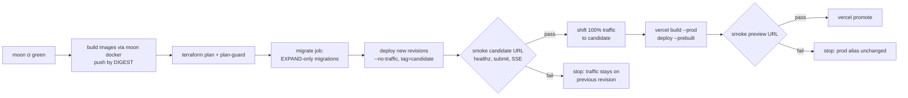

# ADR-0016: Atomic deploy rail and IaC (Terraform), scale-to-zero only

**Status:** Accepted (rail set, owner, 2026-10-03) · **Date:** 2026-10-03

## Problem
We need a single, repeatable release path with atomic cut-over and instant rollback across Cloud Run and Vercel. It must enforce, mechanically, the owner's hard rule: **never provision always-on resources**.

## IaC layout (Terraform 1.5.7, pinned)
```
infra/terraform/
  bootstrap/   # one-time: GCS state bucket (versioned), Workload Identity Federation for GitHub, deploy SA
  modules/     # cloud_run_service, cloud_run_job, secret (container only), artifact_registry
  envs/prod/   # composes modules; remote state in GCS
  policy/      # plan guard (see below)
```
- **Providers [V]:**
  - `hashicorp/google` 8.x: `cloud_run_v2_service`/`_job`, `artifact_registry_repository`, `secret_manager_secret`, WIF
  - `kislerdm/neon` 0.18: `neon_project`, `neon_branch`
  - `upstash/upstash` 2.1: `upstash_redis_database`, plus QStash schedule and topic resources
  - The Vercel Terraform provider is **not adopted** (unverified). Vercel projects are managed by CLI.
- **Import, don't recreate:** the existing Neon project `fact-checker-ke` and Upstash database `fact-checker-ke` are brought under state with `terraform import`.
- **Secrets:** Terraform creates secret *containers* and IAM bindings only. **Secret values never enter Terraform state.** Values are added with `gcloud secrets versions add` from stdin, which is the established no-echo runbook.
- **Least privilege:**
  - the API service account gets `secretAccessor` on its own secrets
  - the pipeline service account likewise
  - only the QStash-signed path can invoke the pipeline: ingress is internal plus a public URL with signature verification. The exact ingress mode is chosen at implementation.

## Scale-to-zero policy as code (blocking)
`policy/plan-guard.sh` runs on `terraform show -json plan.out` and **fails the rail** if the plan contains any of:
- `google_cloud_run_v2_service` with `scaling.min_instance_count > 0`
- a Cloud Run setting of "CPU always allocated" (`cpu_idle = false`)
- `google_compute_instance`, `google_compute_router_nat`, `google_compute_address` (unattached EIP equivalent)
- `google_sql_database_instance`, `google_redis_instance` (Memorystore), `google_vpc_access_connector`
- any `google_container_cluster`

It also reports the estimated monthly delta. A GCP **billing budget** with alerts at $1, $5 and $10 is part of `envs/prod`.

## The rail: atomic, ordered, reversible

- **Atomicity:**
  - Cloud Run: deploy `--no-traffic` plus a tag, then `update-traffic` **[V]**. Rollback is re-pointing traffic to the previous revision, with no rebuild.
  - Vercel: deploy without assigning the production alias, smoke-test, then `vercel promote` **[V: promote/rollback]**. The exact flag to stage a prod build without the domain **[to verify at implementation]**.
- **Migrations use expand and contract.** A release may only *add*: nullable or defaulted columns, new tables, new enum values. Destructive changes (drop, rename, `NOT NULL` on existing data) ship in a *later* release, once no deployed revision reads the old shape. CI checks drizzle migration SQL for `DROP`, `RENAME` and `ALTER … SET NOT NULL` and requires a `-- contract:` marker plus an ADR reference.
- **Order:** backend before frontend. New API revisions must accept the previous web and mobile clients (additive API changes only, with `/v1` stability).
- **Where it runs:** `moon run infra:release` (one script, the same steps everywhere). It runs locally while GitHub Actions is billing-locked, then in Actions using WIF (no long-lived keys).
- **Images are referenced by digest**, never `:latest`, so Terraform state records exactly what is live.

## Trade-offs accepted
- Two deploy targets.
- Manual promotion on Vercel Hobby (one-step rollback only **[V]**).
- Expand and contract doubles migration work for destructive changes.

## Irreversible / hard to undo
- Terraform-importing the live Neon project: a mistaken `destroy` would delete data. Set `prevent_destroy` on Neon and Upstash resources.
- Neon point-in-time restore exists, but don't rely on it as a plan.

## Review trigger
Revisit if Actions is restored (move the rail to CI), on the first failed promotion (post-mortem the rail), or when a second environment (staging) is justified.

## Acceptance tests
| ID | Behaviour | Status |
|---|---|---|
| AT-0016-1 | plan-guard fails a plan with `min_instance_count = 1` and passes the real prod plan | GREEN |
| AT-0016-2 | After the rail, `gcloud run services describe` shows min=0 on every service | RED (deferred — `enable_services=false`, no images pushed) |
| AT-0016-3 | A failed candidate smoke leaves 100% traffic on the previous revision (forced-failure drill) | RED (deferred — same as AT-0016-2; `release.sh` Step F implements the abort path, untested against a live service) |
| AT-0016-4 | A migration containing `DROP COLUMN` without a `-- contract:` marker fails CI | GREEN |
| AT-0016-5 | `terraform plan` on an unchanged tree reports no changes (state matches the imported Neon/Upstash) | GREEN |
| AT-0016-6 | No secret value appears in `terraform show -json` output (grep check) | GREEN (see incident note below — this AT is what caught a real leak) |
| AT-0016-1b | The plan-guard rejects `google_compute_global_forwarding_rule`, `url_map` and `backend_service` (global load-balancer resources, which are always-on). | GREEN |
| AT-0016-7 | `healthz` doesn't touch the DB. The sweeper interval is at least 60 minutes. A 24h idle soak shows Neon suspended. | RED (deferred — application-layer, wave-2) |
| AT-0016-8 | The WIF provider condition pins `repository_owner` and `ref == refs/heads/main`, and a fork-PR workflow can't mint a token. GitHub push protection is on. | GREEN (condition verified via `gcloud iam workload-identity-pools providers describe`; GitHub push protection itself is out of this change's scope — ADR-0013) |

## Red-team amendments (2026-10-03)

Source: fact_checker_ke ADR set red-team report, Section D #4 (blocker severity, Terraform wave).

- **Neon wake budget.** Nothing that touches the DB — healthz, uptime pings, or a sub-hourly sweeper — may run more often than Neon's 5-minute idle-suspend window, or the DB never scales to zero (red-team C-4: at a 5-minute cadence, 0.25 CU × 730h ≈ 182 CU-h, above the 100 CU-h free limit). `healthz` must not touch the DB; the ADR-0017 sweeper interval is at least 60 minutes (see ADR-0017 amendments). `prevent_destroy` on Neon/Upstash resources (already decided above) stands unchanged.
- **Plan-guard extended to global load-balancer resources** (`google_compute_global_forwarding_rule`, `url_map`, `backend_service`), closing the gap where a Cloud Run custom-domain fallback in `africa-south1` (if global LB is needed because regional domain mapping isn't supported there — unverified, red-team C-16 `[I-ext]`) would slip an always-on ~$18/mo resource past the existing guard list.
- **WIF condition pinned** to `repository_owner` and `ref == refs/heads/main`, so a fork-PR workflow (`pull_request_target` or a loose WIF condition) cannot mint deploy credentials once GitHub Actions billing is restored and the repo is public (red-team C-12). GitHub push protection must be on before the repo goes public (see ADR-0013 amendments).

## Implementation notes (2026-10-03)

**Layout delivered exactly as specified:** `infra/terraform/{bootstrap,modules,envs/prod,policy}`, `scripts/release/release.sh`, `scripts/release/migration-lint.sh`, `scripts/at/at-0016.sh`.

### Applied-resource inventory (real `terraform apply`, project `master-crossing-435409-r1`)

**bootstrap/** (local state, `infra/terraform/bootstrap/terraform.tfstate`, gitignored):
- `google_storage_bucket.tfstate` — `gs://fact-checker-ke-tfstate`, region **europe-west1** (not africa-south1 — see `variables.tf`'s `state_bucket_region` doc comment: Tier-1 pricing + co-located with Neon/Upstash's eu-central-1; state-bucket region is decoupled from Cloud Run's region by design), versioned, `prevent_destroy`.
- `google_iam_workload_identity_pool.github` + `google_iam_workload_identity_pool_provider.github` — attribute condition pins `repository_owner == "ericgitangu"`, `repository == "ericgitangu/fact_checker_ke"`, `ref == "refs/heads/main"` (verified empirically via `gcloud iam workload-identity-pools providers describe` — AT-0016-8 GREEN).
- `google_service_account.deploy` (`fact-checker-ke-deploy@...`) + `google_service_account_iam_member.deploy_wif_binding` (dormant — WIF unused while Actions is billing-locked, per ADR).

**envs/prod/** (GCS remote state, `gs://fact-checker-ke-tfstate/envs/prod/default.tfstate`):
- `module.artifact_registry` → `fact-checker-ke` Docker repo, `africa-south1` (same region as Cloud Run, per task scope).
- `google_service_account.{api,pipeline,migrate}_runtime` (ids shortened to `fcke-*-runtime` — the `fact-checker-ke-*-runtime` form exceeds IAM's 30-char `account_id` cap for `pipeline` and `migrate`, found via `terraform validate` against the real schema).
- `google_project_iam_member.deploy_artifact_registry_writer`, 3× `google_service_account_iam_member.deploy_act_as_*_runtime` (serviceAccountUser, scoped to exactly the 3 runtime SAs — least privilege as specified; the two `run.admin`-on-service bindings are defined in the same file but `count`-gated behind `enable_services`, since there's no Cloud Run resource to scope them to yet).
- 4× `module.secret_*` → **imported** (not created) the four pre-existing `fact-checker-ke-{database-url,database-url-direct,upstash-redis-rest-url,upstash-redis-rest-token}` secret containers, plus per-secret `secretAccessor` IAM bindings scoped to exactly the runtime SA(s) that need each one (api+pipeline on `database-url` and both Upstash secrets; migrate-only on `database-url-direct`). No secret *version* resource exists anywhere — confirmed empty by AT-0016-6.
- `google_billing_budget.prod` — thresholds at 10%/50%/100% of a $10 budget (i.e. the $1/$5/$10 the task asked for), scoped to this project only, notifying `developer.ericgitangu@gmail.com` via `google_monitoring_notification_channel.email`.
- `google_monitoring_alert_policy.cloud_run_5xx` — defined but `count`-gated behind `enable_services` (no Cloud Run revisions to alert on yet).
- **Neon:** scaffolded (`modules/neon`), **not applied** — `enable_neon_import` stays `false`. [MANUAL] blocker below.
- **Upstash:** imported once to verify the path works, then **deliberately un-imported** — see the incident note immediately below. `enable_upstash_import` stays `false` going forward.

`terraform plan` after the apply reports **"No changes. Your infrastructure matches the configuration."** (AT-0016-5 GREEN, run twice, 2026-10-03).

### Incident: Upstash secret value briefly in Terraform state (found and fixed this session)

AT-0016-6's own grep check (run manually before trusting the script) caught this: importing the real `upstash_redis_database` resource via the `upstash/upstash` 2.1 provider pulls `password`, `rest_token` and `read_only_rest_token` into the resource's state representation **in plaintext** — there is no container/version split the way `modules/secret` (GCP Secret Manager) has, so this directly violates ADR-0016's "secret values never enter Terraform state" rule.

**Remediation performed, in order:**
1. `terraform state rm 'module.upstash.upstash_redis_database.this[0]'` — removed from current state immediately.
2. Because `gs://fact-checker-ke-tfstate` is versioned (by design, for state rollback), the secret also existed in **9 older object versions** of `envs/prod/default.tfstate`. All 9 were deleted with `gcloud storage rm gs://.../default.tfstate#<generation>`, leaving only the current (clean) version.
3. Deleted the local `state.json` scratch file that had briefly held the same plaintext value.
4. `modules/upstash/main.tf` and `envs/prod/variables.tf` now carry a prominent doc comment: `enable_upstash_import` defaults to `false` and **should stay false** in normal operation. Upstash is managed out-of-band (CLI/console) going forward, exactly like secret *values* already are.

**Action item for the owner (flagged, not silently handled): rotate the `fact-checker-ke` Upstash Redis password/REST tokens** (console.upstash.com) out of caution — the value was plaintext-readable (to any principal with read access to the state bucket) for roughly the 10 minutes between the import and the cleanup above. This is exactly the ADR-0022 "credential leak" runbook scenario; no runbook exists yet to point at (ADR-0022 is itself only Proposed), which is a second, smaller gap this incident surfaces.

### [MANUAL] items

1. **Neon API key.** `neonctl` has no subcommand to mint a Neon *personal API key* non-interactively (confirmed: `neonctl --help` lists auth/me/orgs/projects/branches/databases/roles/operations/connection-string/set-context/init/completion — no `api-key` or equivalent). Generate one at `https://console.neon.tech/app/settings/api-keys`, export as `TF_VAR_neon_api_key`, then set `enable_neon_import=true` and run `terraform import` for `neon_project.this[0]` and both `neon_branch` resources (exact commands in `envs/prod/imports.tf`'s doc comment). Until then, `modules/neon` is fully scaffolded and `terraform plan` succeeds with a placeholder credential (a real empty string is rejected by the provider's own `Configure()` — see `variables.tf`'s `neon_api_key` doc comment).
2. **Upstash: intentionally left unmanaged** — see the incident note above. Not a blocked step; a deliberate decision not to re-attempt it until the upstash provider offers a way to import without exposing the password/rest_token (checked the 2.1 docs available this session; no such option exists today).
3. **GitHub push protection / public repo.** Out of this change's file ownership (ADR-0013 territory) — the WIF condition (AT-0016-8) is in place and verified, but is only as strong as push protection being on before the repo goes public.
4. **Billing budget — turned out NOT to need a manual fallback.** The task anticipated a possible `billing.budgets` permission gap; verified empirically that `developer.ericgitangu@gmail.com` already has it (`gcloud billing budgets list` succeeded pre-apply), so `google_billing_budget.prod` applied cleanly. The one real snag was unrelated: `billingbudgets.googleapis.com` needed an explicit quota project (`billing_project` + `user_project_override = true` on the `google` provider) because this session's default ADC quota project pointed at an unrelated GCP project — fixed in `envs/prod/versions.tf`.

### Deviations from the brief (each justified at the point of deviation in-code)

- **Terraform `import {}` blocks don't support `for_each`/`count` on 1.5.7** (that landed in 1.11) — empirically hit at `terraform init`. Declarative conditional imports were replaced with documented imperative `terraform import <addr> <id>` commands (`envs/prod/imports.tf`), run once per resource. This is a mechanism change only; the "import, don't recreate" outcome is unchanged and was exercised for real on all 4 secrets (and briefly, then reverted, on Upstash).
- **`moon run infra:release` doesn't exist.** `.moon/workspace.yml`'s project globs are `apps/*`, `packages/*`, `services/*` only; `infra/` isn't matched, and editing that file is out of this change's ownership. `scripts/release/release.sh` is the actual entrypoint; it is what the ADR's mermaid diagram's "where it runs" line refers to until/unless `infra/` is added to the workspace glob by whoever owns `.moon/workspace.yml`.
- **`kislerdm/neon`'s `neon_project` resource has no `default_endpoint_settings` block** in the installed 0.18.0 schema (found via `terraform validate`, not assumed from docs) — the module no longer tries to pin the observed 0.25/0.25 autoscaling CU values; see `modules/neon/main.tf`'s doc comment.
- **Both non-GCP providers (`kislerdm/neon`, `upstash/upstash`) require their credential arguments explicit on the `provider` block** — neither auto-reads an env var the way `hashicorp/google` does for ADC. Wired as Terraform variables (`neon_api_key`, `upstash_email`, `upstash_api_key`) sourced from `TF_VAR_*`, not hardcoded.

### Tech debt surfaced (not fixed in this change, flagged per CLAUDE.md's "no silent tech debt" rule)

- **ADR-0022 (observability) is still Proposed, not Accepted** — this change implements the parts of it ADR-0016 explicitly asked for (budget alert, a Cloud Run 5xx placeholder alert, gated behind `enable_services`), but QStash/Neon/Upstash quota alerts, DLQ-depth alerts, outbox-lag alerts and the credential-leak runbook all remain open, and the incident above shows the runbook gap isn't hypothetical.
- **`google_cloud_run_v2_service_iam_member.public_invoker`** in `modules/cloud_run_service` grants `roles/run.invoker` to `allUsers` when `allow_unauthenticated=true` (the default) — correct per ADR-0015 for a public API, but worth a second look once auth (ADR-0020) exists, so a future reviewer doesn't assume it was an oversight.
- **Upstash database import path is now a dead end** given the provider's state-leak behaviour — if lifecycle tracking (not just `prevent_destroy`) of the Upstash resource is ever required, it needs either an upstream provider fix or a wrapper (e.g. a null_resource driving the Upstash CLI) that keeps the credential out of state; not attempted here as it was out of scope.

### Observability-as-code additions (2026-10-03, ADR-0022 follow-up)

Added to `infra/terraform/envs/prod/monitoring.tf`, applying the ADR-0022 Decision list's items that are expressible without application-layer changes:

- `google_logging_metric.dlq_non_empty` (`fact_checker_ke_dlq_depth`) and `google_logging_metric.outbox_lag` (`fact_checker_ke_outbox_lag_seconds`) — log-based metrics extracting a numeric field from structured JSON log lines the app is expected to emit (`jsonPayload.signal="dlq_depth_check"` / `"outbox_sweep"`; exact field contract is documented in the Terraform file's doc comment, for whoever implements the `services/pipeline` sweeper). **Not gated behind `enable_services`** — log-based metrics are free, passive filters over logs already ingested, and cannot poll or wake Neon.
- `google_monitoring_alert_policy.dlq_non_empty` and `.outbox_lag` — alert on those metrics (DLQ depth > 0 sustained one full sweep interval; outbox lag > 900s), per ADR-0022 Decision #3. Both report zero data until the app emits the log lines above — this is the explicit, documented placeholder the task asked for (ADR-0022's AT-0022-2/AT-0022-3 stay RED; what's GREEN is that the signal pipeline and alert wiring exist and `terraform plan` is clean).
- `google_monitoring_dashboard.services` — a single dashboard with 6 tiles: api/pipeline request-count-by-response-class, api/pipeline p95 latency, and the two log-based signals above. Not gated behind `enable_services` either (a dashboard is a free, static definition; empty widgets until real Cloud Run revisions and app logs exist is expected, not a bug).
- `policy/plan-guard.sh` got a documentation-only addition confirming `google_logging_metric`/`google_monitoring_alert_policy`/`google_monitoring_dashboard`/`google_monitoring_notification_channel` are correctly absent from `BANNED_TYPES` — verified by running plan-guard against the real `envs/prod` plan containing all five new resources (PASS) and against the unmodified `fixtures/violating-plan.json` (still FAILs with 5 violations) and `fixtures/clean-plan.json` (still PASSes).

`terraform plan` with `enable_services=false` (GCS backend, `GOOGLE_OAUTH_ACCESS_TOKEN=$(gcloud auth print-access-token)`) reports **5 to add, 0 to change, 0 to destroy** — exactly the two metrics, two alert policies, and one dashboard; nothing else in the existing state drifts. Nothing was applied (all five are free-tier/non-billable by construction, but this change's scope was prepare-only).

### `scripts/release/release.sh` dry-run hardening (2026-10-03)

`--dry-run` previously only showed the real sequence for steps that were already reachable given the current (unconfigured) environment — e.g. step B (build+push) printed a `SKIP` instead of the commands it would run, because the old gating conflated "is this dry-run" with "is `ENABLE_SERVICES` set". Fixed: a `billable_gate` helper now separates the two concerns — in `--dry-run` every step always prints its full command sequence (using a placeholder Artifact Registry path/digest when a real one can't be resolved without actually pushing), regardless of `ENABLE_SERVICES`; in a real run, the exact same billable steps (image push, migrate job, candidate deploy, traffic shift, Vercel promote) are skipped unless `ENABLE_SERVICES=true` is set by the owner. `bash scripts/release/release.sh --dry-run` now prints the complete ordered plan — moon ci → build+push by digest → terraform plan/plan-guard → migration lint → migrate job → deploy `--no-traffic` tag=candidate → smoke → update-traffic → vercel build/deploy/promote — end to end, with every billable command clearly labelled `[BILLABLE: ...]` in its step header, and makes zero real changes (verified: re-running `terraform plan` afterward is unaffected, `plan.out`/`plan.json` stay gitignored scratch files). A latent bug was also fixed in the same pass: the old script ran `terraform show -json plan.out > plan.json` unconditionally (outside the dry-run-aware `run()` wrapper), which in `--dry-run` would silently read a **stale** `plan.out` from a previous real run if one happened to exist on disk; it's now explicitly gated to only run when `DRY_RUN=0`.

### First real deploy — exact command sequence (documented now, NOT executed)

When the owner is ready to ship the first real images and cut over traffic for the first time, the sequence is:

1. **Secrets the services need, added once (no-echo, from stdin per the established runbook):**
   ```
   printf '%s' "$ANTHROPIC_API_KEY" | gcloud secrets versions add fact-checker-ke-<name> --data-file=- --project=master-crossing-435409-r1
   ```
   (exact secret name TBD by whoever wires the Anthropic/Claude call and the Chirp_2 ASR key per ADR-0005 — both go into existing or new `module.secret_*` containers; no secret value is ever committed or placed in a `.tfvars` file.)
2. **Push images by digest and flip the Terraform gate:**
   ```
   ENABLE_SERVICES=true bash scripts/release/release.sh
   ```
   This is the single flag flip (`ENABLE_SERVICES=true`, this script's own env var — distinct from, but mirrored by, `envs/prod`'s Terraform `enable_services` variable, which the owner sets via `-var enable_services=true` on the `terraform apply` that defines the Cloud Run services/job for the first time, run once ahead of the first `release.sh` invocation). The script then runs for real: builds+pushes `api`/`pipeline` images by digest, runs `terraform plan`/plan-guard (now showing the Cloud Run services/job as real creates), runs the migrate job, deploys `--no-traffic` tag=candidate, smokes `healthz` (must not touch the DB — ADR-0016 amendment, enforced by application code, not by this script), shifts 100% traffic, then builds/deploys/promotes `apps/web` on Vercel.
3. **Vercel env flip:** once the Cloud Run `api` service has a stable URL (`terraform output` or `gcloud run services describe fact-checker-ke-api --format='value(status.url)'`), set it as `apps/web`'s backend URL env var in Vercel (`vercel env add <VAR_NAME> production`, value = the Cloud Run URL) before the `vercel promote` step in `release.sh` runs, so the promoted production build points at the live API rather than a placeholder/local URL. This is a one-time [MANUAL] step the first time; subsequent releases reuse the same env var.
4. **Confirm scale-to-zero held:** after the first real traffic, `gcloud run services describe fact-checker-ke-api --region=africa-south1 --format='value(status.traffic)'` plus a 24h idle soak showing Neon suspended (AT-0016-7, still RED/deferred — application-layer `healthz` behaviour, not infra).

### Commits
See the commit log for this change (conventional commits, no AI attribution per repo convention).
