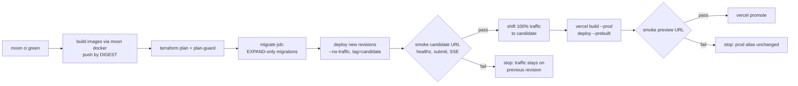

# ADR-0016: Atomic deploy rail and IaC (Terraform), scale-to-zero only

**Status:** Proposed · **Date:** 2026-10-03

## Problem
We need a single, repeatable release path with atomic cut-over and instant rollback across Cloud Run and Vercel. It must enforce, mechanically, the owner's hard rule: **never provision always-on resources**.

## IaC layout (Terraform 1.5.7, pinned)
```
infra/terraform/
  bootstrap/   # one-time: GCS state bucket (versioned), Workload Identity Federation for GitHub, deploy SA
  modules/     # cloud_run_service, cloud_run_job, secret (container only), artifact_registry
  envs/prod/   # composes modules; remote state in GCS
  policy/      # plan guard (see below)
```
- **Providers [V]:**
  - `hashicorp/google` 8.x: `cloud_run_v2_service`/`_job`, `artifact_registry_repository`, `secret_manager_secret`, WIF
  - `kislerdm/neon` 0.18: `neon_project`, `neon_branch`
  - `upstash/upstash` 2.1: `upstash_redis_database`, plus QStash schedule and topic resources
  - The Vercel Terraform provider is **not adopted** (unverified). Vercel projects are managed by CLI.
- **Import, don't recreate:** the existing Neon project `fact-checker-ke` and Upstash database `fact-checker-ke` are brought under state with `terraform import`.
- **Secrets:** Terraform creates secret *containers* and IAM bindings only. **Secret values never enter Terraform state.** Values are added with `gcloud secrets versions add` from stdin, which is the established no-echo runbook.
- **Least privilege:**
  - the API service account gets `secretAccessor` on its own secrets
  - the pipeline service account likewise
  - only the QStash-signed path can invoke the pipeline: ingress is internal plus a public URL with signature verification. The exact ingress mode is chosen at implementation.

## Scale-to-zero policy as code (blocking)
`policy/plan-guard.sh` runs on `terraform show -json plan.out` and **fails the rail** if the plan contains any of:
- `google_cloud_run_v2_service` with `scaling.min_instance_count > 0`
- a Cloud Run setting of "CPU always allocated" (`cpu_idle = false`)
- `google_compute_instance`, `google_compute_router_nat`, `google_compute_address` (unattached EIP equivalent)
- `google_sql_database_instance`, `google_redis_instance` (Memorystore), `google_vpc_access_connector`
- any `google_container_cluster`

It also reports the estimated monthly delta. A GCP **billing budget** with alerts at $1, $5 and $10 is part of `envs/prod`.

## The rail: atomic, ordered, reversible

- **Atomicity:**
  - Cloud Run: deploy `--no-traffic` plus a tag, then `update-traffic` **[V]**. Rollback is re-pointing traffic to the previous revision, with no rebuild.
  - Vercel: deploy without assigning the production alias, smoke-test, then `vercel promote` **[V: promote/rollback]**. The exact flag to stage a prod build without the domain **[to verify at implementation]**.
- **Migrations use expand and contract.** A release may only *add*: nullable or defaulted columns, new tables, new enum values. Destructive changes (drop, rename, `NOT NULL` on existing data) ship in a *later* release, once no deployed revision reads the old shape. CI checks drizzle migration SQL for `DROP`, `RENAME` and `ALTER … SET NOT NULL` and requires a `-- contract:` marker plus an ADR reference.
- **Order:** backend before frontend. New API revisions must accept the previous web and mobile clients (additive API changes only, with `/v1` stability).
- **Where it runs:** `moon run infra:release` (one script, the same steps everywhere). It runs locally while GitHub Actions is billing-locked, then in Actions using WIF (no long-lived keys).
- **Images are referenced by digest**, never `:latest`, so Terraform state records exactly what is live.

## Trade-offs accepted
- Two deploy targets.
- Manual promotion on Vercel Hobby (one-step rollback only **[V]**).
- Expand and contract doubles migration work for destructive changes.

## Irreversible / hard to undo
- Terraform-importing the live Neon project: a mistaken `destroy` would delete data. Set `prevent_destroy` on Neon and Upstash resources.
- Neon point-in-time restore exists, but don't rely on it as a plan.

## Review trigger
Revisit if Actions is restored (move the rail to CI), on the first failed promotion (post-mortem the rail), or when a second environment (staging) is justified.

## Acceptance tests
| ID | Behaviour | Status |
|---|---|---|
| AT-0016-1 | plan-guard fails a plan with `min_instance_count = 1` and passes the real prod plan | RED |
| AT-0016-2 | After the rail, `gcloud run services describe` shows min=0 on every service | RED |
| AT-0016-3 | A failed candidate smoke leaves 100% traffic on the previous revision (forced-failure drill) | RED |
| AT-0016-4 | A migration containing `DROP COLUMN` without a `-- contract:` marker fails CI | RED |
| AT-0016-5 | `terraform plan` on an unchanged tree reports no changes (state matches the imported Neon/Upstash) | RED |
| AT-0016-6 | No secret value appears in `terraform show -json` output (grep check) | RED |
| AT-0016-1b | The plan-guard rejects `google_compute_global_forwarding_rule`, `url_map` and `backend_service` (global load-balancer resources, which are always-on). | RED |
| AT-0016-7 | `healthz` doesn't touch the DB. The sweeper interval is at least 60 minutes. A 24h idle soak shows Neon suspended. | RED |
| AT-0016-8 | The WIF provider condition pins `repository_owner` and `ref == refs/heads/main`, and a fork-PR workflow can't mint a token. GitHub push protection is on. | RED |

## Red-team amendments (2026-10-03)

Source: fact_checker_ke ADR set red-team report, Section D #4 (blocker severity, Terraform wave).

- **Neon wake budget.** Nothing that touches the DB — healthz, uptime pings, or a sub-hourly sweeper — may run more often than Neon's 5-minute idle-suspend window, or the DB never scales to zero (red-team C-4: at a 5-minute cadence, 0.25 CU × 730h ≈ 182 CU-h, above the 100 CU-h free limit). `healthz` must not touch the DB; the ADR-0017 sweeper interval is at least 60 minutes (see ADR-0017 amendments). `prevent_destroy` on Neon/Upstash resources (already decided above) stands unchanged.
- **Plan-guard extended to global load-balancer resources** (`google_compute_global_forwarding_rule`, `url_map`, `backend_service`), closing the gap where a Cloud Run custom-domain fallback in `africa-south1` (if global LB is needed because regional domain mapping isn't supported there — unverified, red-team C-16 `[I-ext]`) would slip an always-on ~$18/mo resource past the existing guard list.
- **WIF condition pinned** to `repository_owner` and `ref == refs/heads/main`, so a fork-PR workflow (`pull_request_target` or a loose WIF condition) cannot mint deploy credentials once GitHub Actions billing is restored and the repo is public (red-team C-12). GitHub push protection must be on before the repo goes public (see ADR-0013 amendments).
