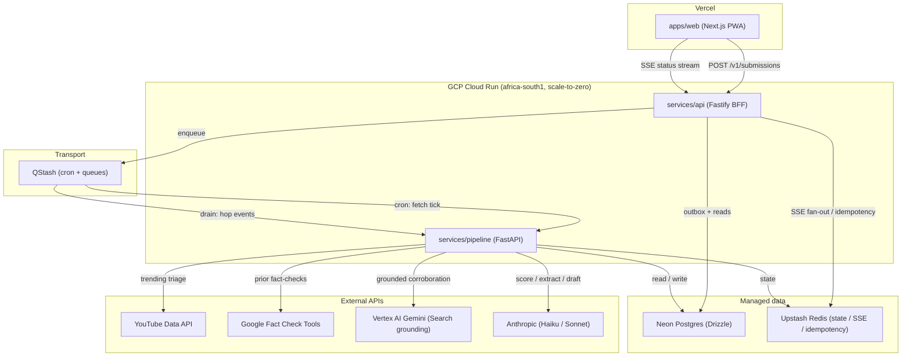
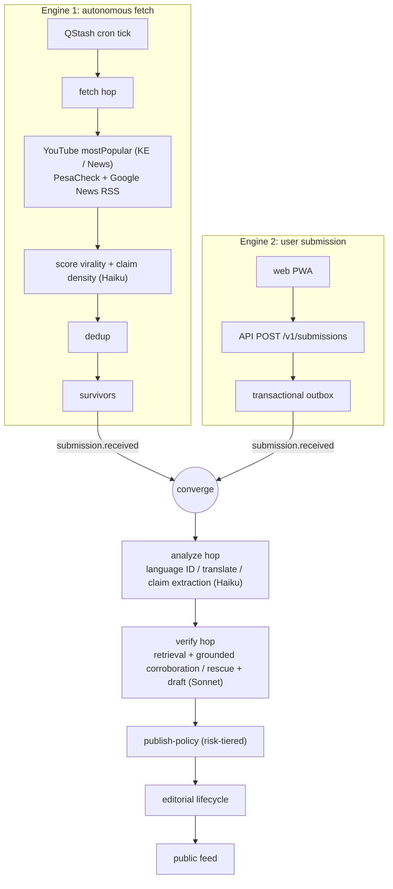
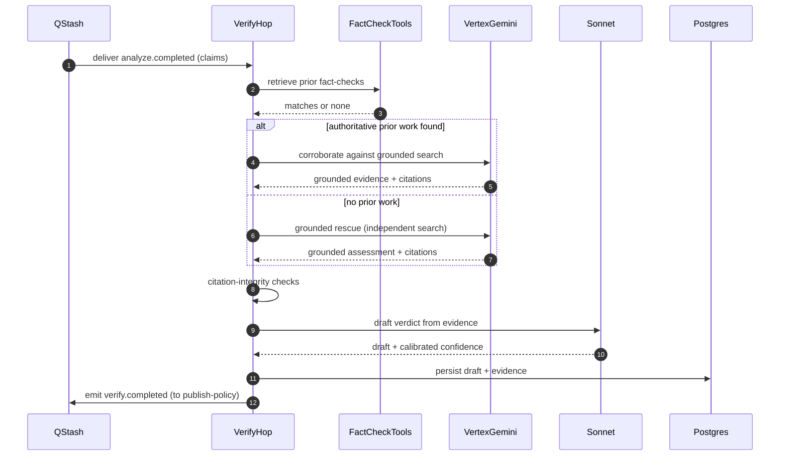
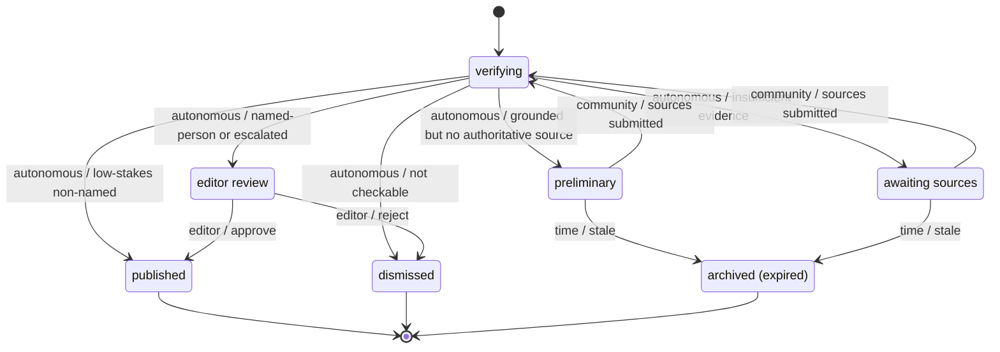
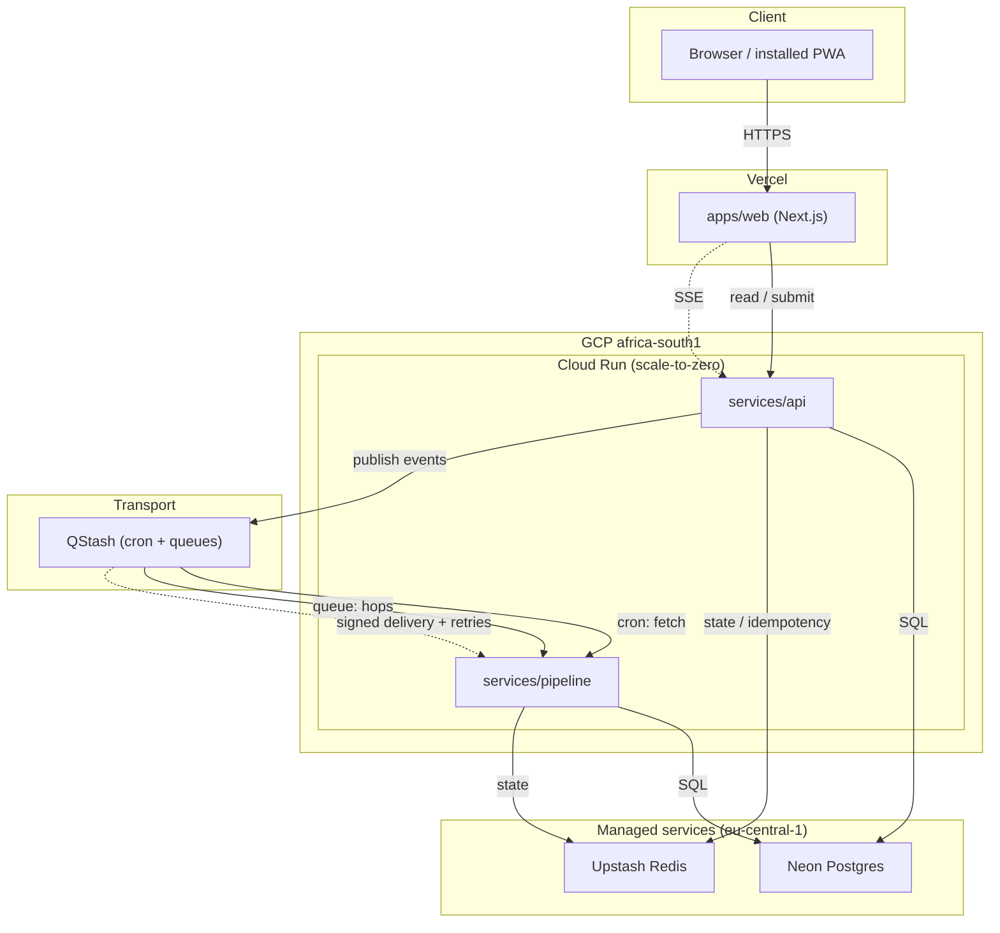

# Architecture

`fact_checker_ke` is a Kenyan fact-checking and maandamano (protest) tracking
system. It ingests public claims from two independent paths — an autonomous
source-polling engine and user submissions — runs them through one shared
analysis-and-verification pipeline, and publishes results under a risk-tiered
editorial lifecycle that never auto-publishes a claim about a named person.

The core is event-driven: every stage hands off through a transactional outbox
drained by QStash, so a crash between stages loses nothing and a replay produces
the same result. Services run on GCP Cloud Run in `africa-south1`, scale to zero
when idle, and persist to Neon serverless Postgres. The web client is a Next.js
PWA on Vercel.

Design decisions behind this document are recorded in `docs/adr/`.

## Components

| Component | Stack | Role |
|---|---|---|
| `apps/web` | Next.js PWA (Vercel) | Public feed, submission UI, live status via SSE |
| `services/api` | Fastify / TypeScript (Cloud Run) | BFF; submission intake, outbox writer, SSE, read APIs |
| `services/pipeline` | FastAPI / Python / uv (Cloud Run) | Fetch, analyze, verify, publish-policy hops |
| `packages/core` | Zod | Shared event and domain schemas, contract validation |
| `packages/db` | Drizzle ORM / Neon | Schema, migrations, typed queries |
| `packages/i18n` | — | English / Swahili message catalogs |

External dependencies: YouTube Data API (region-KE trending triage), Google Fact
Check Tools (prior-work retrieval), Vertex AI Gemini with Google Search grounding
(independent corroboration and grounded rescue), Anthropic Haiku and Sonnet
(claim scoring, extraction, draft writing), Upstash Redis (state, SSE fan-out,
idempotency), and QStash (cron and queue transport).

## System context

The two Cloud Run services split by language and concern: the API is the only
writer on the submission path and the only SSE origin; the pipeline owns all hop
processing. They never call each other directly — QStash is the sole coupling,
which keeps the pipeline insensitive to API restarts (and the reverse) and lets
each scale to zero independently.

Trade-offs. Scale-to-zero means a cold first request after idle; acceptable for a
low-QPS public tool and the reason the submission path is async (the client gets
an id immediately and watches SSE, rather than blocking on a cold pipeline).
Neon and Upstash sit in `eu-central-1` (closest region to `africa-south1`), so
cross-region latency is paid on every DB and Redis round trip — tolerable here
because the hot public-feed reads are cache-friendly and hop processing is not
latency-bound.

## Two-engine data flow

Both engines emit the same `submission.received` event, so everything downstream
of convergence is written and tested once. The difference between an
autonomously-fetched item and a user submission is erased at the convergence
point — provenance is carried as event metadata, not as a separate code path.

Engine 1 spends money (Haiku scoring, API quota) on every candidate, so the cheap
filters run first: virality and claim-density scoring, then dedup, gate what
reaches the shared pipeline. Dedup is also what stops a trending clip and a user
submission of the same clip from becoming two threads.

Failure notes. The fetch hop is idempotent per source-item id, so a cron retry or
overlapping tick re-scores but does not re-emit. The outbox write and the API
response share one transaction: if the client gets `202`, the event is durably
enqueued; if the transaction fails, the client gets an error and nothing leaks
into the pipeline.

## Verify hop

Retrieval runs before any model writes a verdict: if Google Fact Check Tools
already has authoritative prior work, Gemini corroborates against it rather than
re-deriving the answer. When there is no prior work, the grounded-rescue branch
has Gemini search independently so a novel claim still gets an evidence-backed
assessment instead of being dropped.

The citation-integrity check sits between evidence gathering and drafting: every
claim the draft will rest on must trace to a retrieved source. This is the guard
against a fluent but unsupported verdict — a draft whose citations do not hold up
cannot reach publish-policy as a verdict. A grounded assessment that produced no
authoritative source is still kept, but it is routed as a labelled, non-verdict
"preliminary" (see the lifecycle below), not as a decision.

Sonnet writes the draft and a calibrated confidence; that confidence is an input
to publish-policy weighting, not a publish decision on its own.

## Editorial status lifecycle

Triggers are labelled by actor: **autonomous** (the pipeline's own
publish-policy), **community** (crowdsourced source submissions),
**editor** (a human in the review queue), **time** (the staleness sweep).

The invariant the state machine enforces: a claim about a named person never
reaches `published` from `verifying` directly — it must pass through
`editor_review`. Low-stakes, non-named items can auto-publish. An item the
pipeline can ground but for which no authoritative source exists becomes a
`preliminary` — public, but explicitly labelled as a non-authoritative
assessment, not a verdict.

`preliminary` and `awaiting_sources` are the open, improvable states: a
crowdsourced source submission moves them back to `verifying` for
re-verification. This is the loop that lets the system improve a result after
first publication without a human in the path, while still capping unbounded open
items — the staleness sweep expires anything that sits open too long to
`archived_expired`. Terminal states are `published`, `dismissed`, and
`archived_expired`; nothing leaves them.

## Deployment topology

Cron and queue delivery are the same transport: QStash fires the fetch tick on a
schedule and drains hop events from the outbox, delivering both to the pipeline
over signed HTTP with retries. There is no always-on worker — the pipeline exists
only while QStash is delivering, which is what makes scale-to-zero viable for the
processing path.

Idempotency keys are carried on both the API intake and the pipeline consumers,
so QStash's at-least-once delivery (and its retries) cannot double-process a hop.
Redis holds the SSE fan-out state and the idempotency ledger; a Redis outage
degrades live status updates and idempotency dedup but does not corrupt the
durable record, which lives in Postgres.

Connection strings are held in GCP Secret Manager and injected into Cloud Run at
deploy; they are never baked into images.
